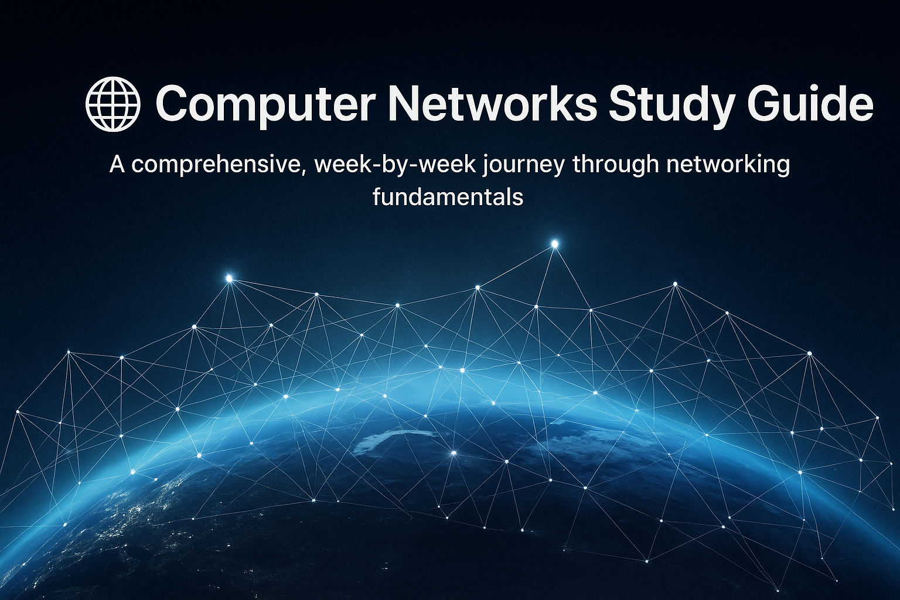

  

## Repository Structure
---

### Week 1: Network Fundamentals
- **[Basic Networking Concepts](Weekly-Progress/Week-1/01-Basic%20Networking%20Concepts.md)** - Internet, Protocols, Network Architecture
- **[IP Addressing Fundamentals](Weekly-Progress/Week-1/02-IP%20Addressing%20Fundamentals.md)** - IPv4 Structure, CIDR, Subnet Masks
- **[DHCP Protocol](Weekly-Progress/Week-1/03-DHCP%20Protocol.md)** - Dynamic Host Configuration Protocol
- **[Standards Organizations](Weekly-Progress/Week-1/04-Standards%20Organization.md)** - RFC, IETF, Internet Standards

### Week 2: Access Networks
- Coming Soon...

### Week 3: Network Layer
- Coming Soon...

## Study Approach

This repository follows a structured learning path:

1. **Conceptual Understanding** - High-level concepts and terminology
2. **Technical Details** - Implementation specifics and protocols
3. **Practical Applications** - Real-world examples and configurations
4. **Troubleshooting** - Common issues and solutions

## Navigation Tips

- Each topic has its own dedicated folder with detailed README
- Use table of contents in each file for quick navigation
- Examples progress from simple to complex
- Key concepts are highlighted throughout

## Prerequisites

Basic understanding of:
- Computer operations
- Network connectivity concepts
- Binary number system (helpful but not required)

## Contributing

Feel free to:
- Report errors or unclear explanations
- Suggest additional examples
- Propose new topics for coverage

## License

This educational content is available for learning purposes.

---

**Next Week Preview**: Access Networks - DSL, Cable, Fiber, Wireless technologies

---
